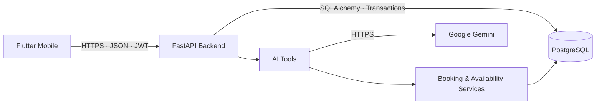

<div align="center">

# SlotBridge

**Готовая мобильная система записи клиентов, управления расписанием и интеллектуального подбора времени.**

[](https://slotbridge-api.onrender.com)
[](https://github.com/artyom129/SlotBridge/releases/tag/v1.1.5)
[](https://github.com/artyom129/SlotBridge/actions/workflows/tests.yml)
[](LICENSE.md)

[](https://flutter.dev/)
[](https://fastapi.tiangolo.com/)
[](https://www.postgresql.org/)
[](https://ai.google.dev/)
[](https://www.python.org/)

**[Скачать APK](https://github.com/artyom129/SlotBridge/releases/download/v1.1.5/SlotBridge-1.1.5-9-production.apk)** ·
**[GitHub Release](https://github.com/artyom129/SlotBridge/releases/tag/v1.1.5)** ·
**[Production API](https://slotbridge-api.onrender.com)** ·
**[Архитектура](docs/architecture.md)** ·
**[Настройка](docs/setup.md)**

</div>

> **Статус проекта:** завершён и развёрнут. Основной функционал зафиксирован; дальнейшие изменения предназначены только для критических исправлений и технического обслуживания.

Актуальная Android-версия: **1.1.5 (versionCode 9)**.

## О проекте

SlotBridge — мобильная система для записи клиентов и управления расписанием. Клиент может выбрать услугу и сотрудника, увидеть реальные свободные слоты, создать запись, перенести её или отменить. Backend контролирует доступность, предотвращает двойное бронирование и хранит данные в PostgreSQL.

Поверх базового booking-flow реализованы интеллектуальные сценарии: **Smart Slots**, **Waitlist**, **Conflict Rescue**, **Multi-Service Smart Journey** и **SlotBridge AI** на базе Google Gemini.

Проект работает как полноценная связка **Flutter → FastAPI → PostgreSQL**, развёрнутая на Render и Supabase.

## Ключевые возможности

| Направление | Возможности |
|---|---|
| Запись клиентов | выбор услуги, сотрудника и реального свободного времени |
| Управление записью | создание, перенос, отмена, список и детали записей |
| Умное расписание | Smart Slots, Waitlist, Conflict Rescue |
| Несколько услуг | Multi-Service Smart Journey с несколькими стратегиями маршрута |
| AI-ассистент | поиск услуг, сотрудников, слотов, подготовка записи, переноса и отмены естественным языком |
| Профиль | регистрация, вход, редактирование имени, фамилии и телефона |
| Интерфейс | русский / английский, светлая / тёмная / системная тема |
| Обновления | встроенная проверка новой версии, загрузка APK и SHA-256 verification |
| Надёжность | транзакции, idempotency, tenant isolation, защита от двойного бронирования |

## SlotBridge AI

Ассистент на базе Google Gemini работает поверх реальных данных SlotBridge и backend-инструментов приложения.

Он умеет:

- находить услуги и сотрудников по естественному запросу;
- понимать дату, день недели и время;
- проверять реальную доступность;
- подготавливать запись, перенос и отмену;
- работать с multi-service запросами;
- сохранять контекст между шагами диалога;
- требовать явное подтверждение перед изменением данных.

Gemini **не подключается напрямую к PostgreSQL** и не получает доступ к JWT, паролям или секретам. Все действия проходят через разрешённые backend-инструменты и доменные сервисы SlotBridge.

## Multi-Service Smart Journey

Smart Journey позволяет собрать несколько услуг в один визит и автоматически построить подходящий маршрут с учётом:

- доступности сотрудников;
- длительности каждой услуги;
- свободных слотов;
- ожидания между услугами;
- количества задействованных специалистов.

Доступны три стратегии:

- **Быстрее всего** — минимальная общая длительность визита;
- **Как можно раньше** — наиболее раннее начало;
- **Меньше сотрудников** — минимум переходов между специалистами.

Маршрут бронируется **атомарно**: если один из шагов конфликтует с уже занятым временем, частичная запись не создаётся.

## Архитектура



Подробное описание компонентов и потоков данных: [`docs/architecture.md`](docs/architecture.md).

## Технологии

| Слой | Стек |
|---|---|
| Mobile | Flutter, Dart, Riverpod, GoRouter, Dio, Secure Storage |
| Backend | Python 3.12, FastAPI, SQLAlchemy, Alembic |
| Database | PostgreSQL |
| AI | Google Gemini API |
| Infrastructure | Render, Supabase PostgreSQL, GitHub Releases |
| Testing | Pytest, Flutter Test, GitHub Actions |

## Надёжность и безопасность

- JWT-аутентификация;
- RBAC и tenant isolation;
- Argon2 для паролей;
- транзакции PostgreSQL;
- exclusion constraint и защита от double booking;
- idempotency для критических операций;
- HMAC-проверка webhook-сценариев;
- подтверждение пользователя перед AI-изменениями;
- backend-only хранение `GEMINI_API_KEY`;
- секреты не вшиваются в mobile и не хранятся в Git;
- production API работает по HTTPS.

## Android updater

Встроенный updater проверяет наличие новой версии при запуске приложения, после возврата из фона и вручную из интерфейса.

Перед установкой:

1. backend возвращает метаданные актуального релиза;
2. APK загружается из GitHub Releases;
3. приложение проверяет SHA-256;
4. файл передаётся системному Android installer;
5. обновление устанавливается поверх текущей версии без потери локальных данных при совпадении подписи и `applicationId`.

## Production

| Компонент | Состояние |
|---|---|
| Android | **v1.1.5 · versionCode 9** |
| Backend | [Render](https://slotbridge-api.onrender.com) |
| Database | Supabase PostgreSQL |
| Transport | HTTPS |
| APK | [GitHub Releases](https://github.com/artyom129/SlotBridge/releases/tag/v1.1.5) |
| Health | `GET /api/v1/health/live` |

Render используется на бесплатном тарифе, поэтому первый запрос после периода простоя может занять больше времени из-за cold start.

## Структура репозитория

| Каталог | Назначение |
|---|---|
| `app/` | FastAPI API, модели, схемы и backend-сервисы |
| `mobile/` | Flutter-клиент для Android |
| `tests/` | backend unit, integration и concurrency tests |
| `alembic/` | миграции PostgreSQL |
| `docs/` | архитектура и инструкции по запуску |
| `scripts/` | startup, seed и вспомогательные сценарии |
| `.github/workflows/` | CI workflow |

## Локальный запуск

Полная инструкция: [`docs/setup.md`](docs/setup.md).

### Backend

```powershell
python -m venv .venv
.\.venv\Scripts\Activate.ps1
python -m pip install -r requirements.txt
Copy-Item .env.example .env
alembic upgrade head
uvicorn app.main:app --host 0.0.0.0 --port 8000 --reload
```

Swagger UI: `http://127.0.0.1:8000/docs`.

### Windows native PostgreSQL

```powershell
.\start_slotbridge.bat
```

Остановка:

```powershell
.\stop_slotbridge.bat
```

### Docker

```powershell
docker compose up --build
```

### Mobile

```powershell
cd mobile
flutter pub get
flutter run --dart-define=API_BASE_URL=http://192.168.100.7:8000
```

Production build:

```powershell
flutter build apk --release --dart-define=API_BASE_URL=https://slotbridge-api.onrender.com
```

## Переменные окружения

`.env.example` содержит безопасные placeholders. Основные переменные:

| Переменная | Назначение |
|---|---|
| `SLOTBRIDGE_ENVIRONMENT` | `development`, `test` или `production` |
| `DATABASE_URL` | PostgreSQL connection URL |
| `JWT_SECRET` | секрет подписи JWT |
| `CORS_ALLOWED_ORIGINS` | разрешённые origins |
| `GEMINI_API_KEY` | backend-only ключ Gemini |
| `GEMINI_MODEL` | используемая модель Gemini |

Production-секреты задаются на hosting-платформе и не должны попадать в Git.

## Проверка

Backend:

```powershell
python -m pytest
```

Flutter:

```powershell
cd mobile
flutter analyze
flutter test
```

В репозитории также настроен GitHub Actions workflow для автоматизированных проверок.

## Автор

**Artyom Koncha**  
Information Systems · Python / Backend / Automation

GitHub: [@artyom129](https://github.com/artyom129)

## Лицензия

SlotBridge распространяется по собственной **Proprietary License / All Rights Reserved**. Проект разрешено использовать для академической оценки в пределах условий лицензии; авторство и исключительные права не передаются образовательной организации автоматически.

Полные условия: [LICENSE](LICENSE.md) · [NOTICE](NOTICE)

**Copyright © 2026 Artyom Koncha. All Rights Reserved.**
