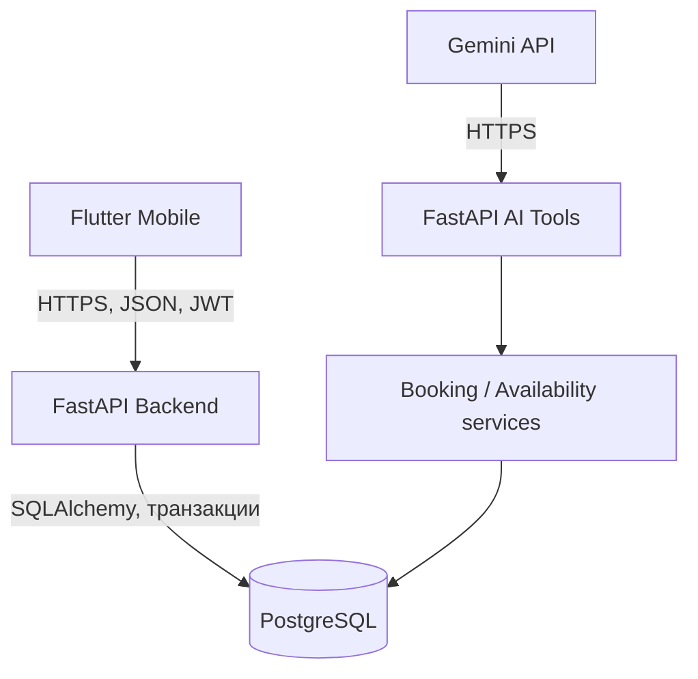

# SlotBridge

**Мобильная система автоматизации записи клиентов, управления расписанием и интеллектуального подбора времени.**

[](https://flutter.dev/)
[](https://fastapi.tiangolo.com/)
[](https://www.postgresql.org/)
[](https://ai.google.dev/)
[](https://github.com/artyom129/SlotBridge/releases/tag/v1.1.5)
[](https://www.python.org/)

[**Скачать APK**](https://github.com/artyom129/SlotBridge/releases/download/v1.1.5/SlotBridge-1.1.5-9-production.apk) ·
[**Открыть GitHub Release**](https://github.com/artyom129/SlotBridge/releases/tag/v1.1.5) ·
[**Production API**](https://slotbridge-api.onrender.com) ·
[**Документация**](docs/architecture.md)

Актуальная Android-версия: **1.1.5 (versionCode 9)**.

## Возможности

- регистрация, вход и защищённая сессия;
- профиль с редактированием имени, фамилии и телефона;
- русский и английский интерфейс;
- светлая, тёмная и системная темы;
- выбор услуги, сотрудника и реального свободного времени;
- создание, перенос и отмена записи;
- список и детали записей пользователя;
- Waitlist, Smart Slots и Conflict Rescue;
- Multi-Service Smart Journey для записи на несколько услуг;
- отзывы после завершённой записи, рейтинг специалистов и официальный ответ;
- встроенная проверка и установка новых версий APK.

## Отзывы и рейтинг качества

Отзыв создаётся только владельцем завершённой записи и всегда наследует
организацию, услугу и специалиста из appointment — эти идентификаторы не
принимаются от клиента. На одну запись допускается один отзыв; это защищено как
проверкой сервиса, так и `UNIQUE` constraint PostgreSQL.

Публично показываются только отзывы `PUBLISHED`. Анонимный режим скрывает имя
клиента, но сохраняет автора в закрытом audit trail. Клиент может изменить или
отозвать отзыв в течение настраиваемого окна (по умолчанию 24 часа). Сотрудник
может ответить только на собственный отзыв, а ADMIN — модерировать, разбирать
жалобы и смотреть агрегаты. Скрытие не удаляет данные физически.

Рейтинг рассчитывается по опубликованным отзывам: среднее, количество,
распределение 1–5 и средние оценки качества, сервиса и пунктуальности. После
оценки 4–5 приложение может предложить открыть официальную HTTPS-карточку 2GIS;
передача внутреннего отзыва во внешний сервис не выполняется.
Это сознательная граница интеграции: официальная документация Places API
указывает, что API умеет фильтровать организации по наличию отзывов, но получение
самих отзывов не поддерживается; документированного публичного API для
публикации отзыва от имени клиента SlotBridge не использует:
[2GIS Places API](https://docs.2gis.com/en/api/search/places/examples/filtering).

Admin AI summary получает только ограниченный набор анонимизированных оценок,
дат, услуг, сотрудников и очищенных комментариев. Gemini не получает client,
appointment, JWT или database identifiers, а результат не используется как
автоматическое основание для санкций.

## SlotBridge AI

Ассистент на базе Google Gemini помогает искать услуги, сотрудников и свободное
время по реальным данным SlotBridge. Он может подготовить запись, перенос или
отмену, распознать запрос на несколько услуг и предложить подходящий маршрут.

Перед любым изменением данных требуется подтверждение пользователя. Для
временных ошибок предусмотрены повтор запроса, ограничение частоты и безопасный
fallback. Gemini вызывает только разрешённые backend-инструменты и **не имеет
прямого доступа к PostgreSQL, JWT или секретам**.

## Multi-Service Smart Journey

Пользователь может выбрать несколько услуг за один визит. SlotBridge строит
маршрут с учётом сотрудников, свободного времени, длительности услуг и ожидания
между ними.

Доступны три стратегии:

- **Быстрее всего** — минимальная общая длительность визита;
- **Как можно раньше** — наиболее раннее начало;
- **Меньше сотрудников** — минимум переходов между специалистами.

Весь маршрут бронируется **атомарно**. Если хотя бы один шаг конфликтует с уже
занятым временем, частичная запись не создаётся.

## Архитектура



Gemini работает только через белый список AI-инструментов FastAPI и не
соединяется с базой данных напрямую. Подробнее: [архитектура проекта](docs/architecture.md).

## Технологии

| Часть | Технологии |
|---|---|
| Mobile | Flutter, Dart, Riverpod, GoRouter, Dio |
| Backend | Python, FastAPI, SQLAlchemy, Alembic |
| Database | PostgreSQL |
| AI | Google Gemini API |
| Infrastructure | Render, Supabase PostgreSQL, GitHub Releases |
| Testing | Pytest, Flutter Test |

## Надёжность и безопасность

- JWT-аутентификация и ролевая модель доступа (RBAC);
- изоляция данных организаций (tenant isolation);
- идемпотентность операций записи;
- транзакции PostgreSQL и exclusion constraint;
- защита от двойного бронирования, включая конкурентные запросы;
- белый список AI-инструментов и подтверждение перед изменением данных;
- секреты хранятся только в локальном `.env` или secrets hosting-платформы;
- production работает по HTTPS, database credentials не попадают в mobile.

## Обновление Android-приложения

Updater проверяет версию при запуске, после возврата приложения из фона и
вручную через раздел профиля. Метаданные приходят с backend, APK загружается из
GitHub Releases. Перед установкой приложение сверяет SHA-256, затем передаёт файл
системному Android installer. Та же подпись и applicationId позволяют установить
обновление поверх текущей версии без потери локальных данных.

## Скриншоты

В репозитории пока нет проверенного набора актуальных снимков production-версии.
Структура и правила добавления реальных изображений подготовлены в
[`docs/screenshots/`](docs/screenshots/README.md). Макеты и сгенерированные
изображения вместо интерфейса приложения не используются.

## Структура репозитория

| Каталог | Назначение |
|---|---|
| `app/` | FastAPI API, модели, схемы и сервисы приложения |
| `mobile/` | Flutter-клиент для Android |
| `tests/` | Backend unit, integration и concurrency tests |
| `alembic/` | Версионируемые миграции PostgreSQL |
| `docs/` | Архитектура, настройка и материалы проекта |
| `scripts/` | Startup, seed и вспомогательные сценарии |

## Локальный запуск

Полная инструкция находится в [`docs/setup.md`](docs/setup.md). Ниже — короткий
вариант.

### Backend

Требуются Python 3.12 и PostgreSQL. В PowerShell:

```powershell
python -m venv .venv
.\.venv\Scripts\Activate.ps1
python -m pip install -r requirements.txt
Copy-Item .env.example .env
```

Укажите локальные `DATABASE_URL` и `JWT_SECRET` в `.env`, затем выполните:

```powershell
alembic upgrade head
uvicorn app.main:app --host 0.0.0.0 --port 8000 --reload
```

Swagger UI: `http://127.0.0.1:8000/docs`.

### Windows native PostgreSQL mode

Если PostgreSQL установлен как Windows service, используйте:

```powershell
.\start_slotbridge.bat
```

Сценарий проверит окружение, применит миграции и запустит backend. Остановка:

```powershell
.\stop_slotbridge.bat
```

Docker Desktop для этого режима не нужен.

### Docker mode

```powershell
docker compose up --build
```

Контейнер backend ждёт PostgreSQL, применяет Alembic migrations и запускает API.
Demo seed не выполняется автоматически в production.

### Mobile

```powershell
cd mobile
flutter pub get
flutter run --dart-define=API_BASE_URL=http://192.168.100.7:8000
```

Для production-сборки передаётся HTTPS URL:

```powershell
flutter build apk --release --dart-define=API_BASE_URL=https://slotbridge-api.onrender.com
```

Production APK уже доступен по ссылке в начале README; для знакомства с проектом
пересобирать его не требуется.

## Переменные окружения

`.env.example` содержит только безопасные development placeholders. Основные
переменные:

| Переменная | Назначение |
|---|---|
| `SLOTBRIDGE_ENVIRONMENT` | `development`, `test` или `production` |
| `DATABASE_URL` | PostgreSQL connection URL |
| `JWT_SECRET` | секрет подписи JWT |
| `CORS_ALLOWED_ORIGINS` | разрешённые origins |
| `GEMINI_API_KEY` | backend-only ключ Gemini |
| `GEMINI_MODEL` | используемая модель Gemini |
| `REVIEW_EDIT_WINDOW_HOURS` | срок редактирования отзыва, по умолчанию `24` |

Настоящие значения не должны попадать в Git. Для production они задаются в
Render secrets; Supabase используется только как PostgreSQL database.

## Миграции базы данных

```powershell
alembic current
alembic upgrade head
```

Alembic управляет схемой и PostgreSQL-ограничениями. Не создавайте production
таблицы вручную и не заменяйте PostgreSQL на SQLite.

Модуль отзывов добавляет миграция `20260924_0006`: `reviews`,
`review_reports`, `review_replies`, `review_audit_log` и безопасную optional
ссылку организации на 2GIS.

## Review API

| Endpoint | Назначение |
|---|---|
| `POST /reviews` | отзыв владельца на завершённую запись |
| `GET/PATCH/DELETE /reviews/{id}` | просмотр, изменение, мягкий отзыв публикации |
| `GET /me/reviews` | история отзывов клиента |
| `GET /appointments/{id}/review` | отзыв конкретной записи |
| `GET /employees/{id}/reviews` | опубликованные отзывы, pagination/filter/sort |
| `GET /employees/{id}/rating` | rating aggregates и распределение |
| `POST /reviews/{id}/reports` | жалоба без повторного спама |
| `PUT /reviews/{id}/reply` | официальный ответ сотрудника/организации |
| `GET /admin/organizations/{id}/reviews` | moderation queue и причины жалоб |
| `PATCH /admin/reviews/{id}/moderation` | скрыть, flag или восстановить |
| `PATCH /admin/review-reports/{id}` | закрыть или отклонить жалобу |
| `GET /admin/organizations/{id}/reviews/analytics` | агрегаты с фильтрами |
| `GET /admin/organizations/{id}/reviews/ai-summary` | privacy-safe Gemini summary |

## Production

- backend: [Render](https://slotbridge-api.onrender.com);
- database: Supabase Free PostgreSQL;
- transport: HTTPS;
- Android APK: [GitHub Releases](https://github.com/artyom129/SlotBridge/releases/tag/v1.1.5).

На бесплатном Render первый запрос после простоя может занять больше времени из-за
cold start. Health endpoint: `GET /api/v1/health/live`.

## Проверка проекта

Backend:

```powershell
python -m pytest
```

Flutter:

```powershell
cd mobile
flutter analyze
flutter test
```

Последняя локальная проверка перед подготовкой документации: backend — **111
passed, 6 skipped**, Flutter — **40 passed, 1 skipped**, `flutter analyze` — без
замечаний. Актуальное состояние основной ветки также проверяется GitHub Actions.

## О проекте

SlotBridge разработан как учебный проект по специальности «Информационные
системы».

Автор: [Artyom Koncha](https://github.com/artyom129)

## Лицензия

Условия использования приведены в [LICENSE](LICENSE) и [NOTICE](NOTICE).

© 2026 Artyom Koncha.

All Rights Reserved.
