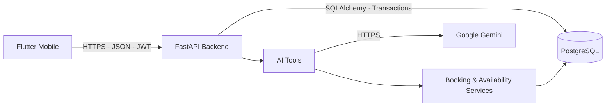

<div align="center">

# SlotBridge

**Production-ready mobile booking, scheduling, and intelligent availability platform.**

[](https://slotbridge-api.onrender.com)
[](https://github.com/artyom129/SlotBridge/releases/tag/v1.1.6)
[](https://github.com/artyom129/SlotBridge/actions/workflows/tests.yml)
[](LICENSE.md)

[](https://flutter.dev/)
[](https://fastapi.tiangolo.com/)
[](https://www.postgresql.org/)
[](https://ai.google.dev/)
[](https://www.python.org/)

**[Download APK](https://github.com/artyom129/SlotBridge/releases/download/v1.1.6/SlotBridge-1.1.6-10-production.apk)** ·
**[GitHub Release](https://github.com/artyom129/SlotBridge/releases/tag/v1.1.6)** ·
**[Production API](https://slotbridge-api.onrender.com)** ·
**[Architecture](docs/architecture.md)** ·
**[Setup](docs/setup.md)**

</div>

> **Project status:** completed and deployed. The core product is stable; further changes are intended for maintenance and critical fixes only.

Current Android version: **1.1.6 (versionCode 10)**.

## About

SlotBridge is a mobile booking and scheduling system for service businesses. Clients can choose a service and specialist, view real availability, create appointments, reschedule them, or cancel them. The backend validates availability, prevents double booking, and stores production data in PostgreSQL.

On top of the core booking flow, SlotBridge includes **Smart Slots**, **Waitlist**, **Conflict Rescue**, **Multi-Service Smart Journey**, **reviews and specialist ratings**, and **SlotBridge AI** powered by Google Gemini.

The production architecture is built as **Flutter → FastAPI → PostgreSQL**, deployed with Render and Supabase.

## Key Features

| Area | Capabilities |
|---|---|
| Client booking | Service, specialist, and real-time slot selection |
| Appointment management | Create, reschedule, cancel, list, and view appointment details |
| Smart scheduling | Smart Slots, Waitlist, Conflict Rescue |
| Multi-service visits | Multi-Service Smart Journey with multiple optimization strategies |
| AI assistant | Natural-language service, specialist, availability, booking, rescheduling, and cancellation flows |
| Profile | Registration, login, first name, last name, and phone editing |
| Reviews | Post-appointment reviews, specialist ratings, reports, moderation, and official replies |
| Interface | Russian / English localization and light / dark / system themes |
| Updates | In-app update checks, APK download, and SHA-256 verification |
| Reliability | Transactions, idempotency, tenant isolation, and double-booking protection |

## Reviews and Quality Ratings

A review can only be created by the owner of a **COMPLETED** appointment. The organization, service, and specialist are derived from the appointment itself rather than trusted from client input. Each appointment can have at most one review, enforced both at the service layer and with a PostgreSQL `UNIQUE` constraint.

Only `PUBLISHED` reviews are visible publicly. Anonymous mode hides the client's identity from public responses while preserving authorship in the internal audit trail. Clients can edit or withdraw a review during a configurable edit window, which defaults to 24 hours.

Employees may reply only to reviews associated with their own profile. Administrators can moderate reviews, process reports, restore hidden reviews, and inspect aggregated review analytics. Moderation is non-destructive: hidden reviews remain stored for auditability.

Specialist rating aggregates include:

- average rating;
- total published review count;
- 1-to-5-star distribution;
- average quality, service, and punctuality scores.

For 4- or 5-star feedback, the app may offer an explicit link to the organization's official 2GIS page. SlotBridge does **not** automatically publish internal review content to 2GIS. The integration remains intentionally limited to a verified HTTPS destination because the public 2GIS Places API does not provide a documented review publishing flow for this use case: [2GIS Places API](https://docs.2gis.com/en/api/search/places/examples/filtering).

The administrator AI summary receives only a limited privacy-safe set of ratings, dates, service/specialist metadata, and sanitized review comments. Gemini does not receive client IDs, appointment IDs, JWTs, passwords, or database identifiers. AI summaries are informational and are not used as an automatic basis for employee sanctions.

## SlotBridge AI

SlotBridge AI uses Google Gemini on top of real SlotBridge backend tools and domain services.

The assistant can:

- find services and specialists from natural-language requests;
- understand dates, weekdays, and times;
- check real availability;
- prepare bookings, rescheduling, and cancellations;
- process multi-service requests;
- preserve conversational context between steps;
- require explicit confirmation before any data-changing action.

Gemini **does not connect directly to PostgreSQL** and has no access to JWTs, passwords, or application secrets. All actions pass through approved backend tools and SlotBridge domain services.

## Multi-Service Smart Journey

Smart Journey combines multiple services into a single visit and automatically builds a suitable route while considering:

- specialist availability;
- duration of each service;
- open time slots;
- waiting time between services;
- number of specialists involved.

Available strategies:

- **Fastest** — minimizes total visit duration;
- **Earliest** — finds the earliest possible start time;
- **Fewer specialists** — minimizes specialist changes during the visit.

The final journey is booked **atomically**. If any step conflicts with an already occupied slot, no partial booking is created.

## Architecture



Detailed component and data-flow documentation: [`docs/architecture.md`](docs/architecture.md).

## Technology Stack

| Layer | Stack |
|---|---|
| Mobile | Flutter, Dart, Riverpod, GoRouter, Dio, Secure Storage |
| Backend | Python 3.12, FastAPI, SQLAlchemy, Alembic |
| Database | PostgreSQL |
| AI | Google Gemini API |
| Infrastructure | Render, Supabase PostgreSQL, GitHub Releases |
| Testing | Pytest, Flutter Test, GitHub Actions |

## Reliability and Security

- JWT authentication;
- RBAC and tenant isolation;
- Argon2 password hashing;
- PostgreSQL transactions;
- exclusion constraints and double-booking protection;
- idempotency for critical operations;
- HMAC verification for webhook flows;
- explicit confirmation before AI-triggered mutations;
- backend-only `GEMINI_API_KEY` storage;
- no secrets embedded in the mobile application or committed to Git;
- HTTPS-only production API.

## Android Updater

The built-in updater checks for a newer version when the app starts, after returning from the background, and when triggered manually from the UI.

Before installation:

1. the backend returns metadata for the current release;
2. the APK is downloaded from GitHub Releases;
3. the application verifies its SHA-256 hash;
4. the file is passed to the Android system installer;
5. the update installs over the current application when the signature and `applicationId` match.

## Production

| Component | Status |
|---|---|
| Android | **v1.1.6 · versionCode 10** |
| Backend | [Render](https://slotbridge-api.onrender.com) |
| Database | Supabase PostgreSQL |
| Transport | HTTPS |
| APK | [GitHub Releases](https://github.com/artyom129/SlotBridge/releases/tag/v1.1.6) |
| Health | `GET /api/v1/health/live` |

Render is currently used on a free tier, so the first request after an idle period may take longer because of cold start.

## Repository Structure

| Directory | Purpose |
|---|---|
| `app/` | FastAPI API, models, schemas, and backend services |
| `mobile/` | Flutter Android client |
| `tests/` | Backend unit, integration, and concurrency tests |
| `alembic/` | PostgreSQL migrations |
| `docs/` | Architecture and setup documentation |
| `scripts/` | Startup, seed, verification, and helper scripts |
| `.github/workflows/` | CI workflows |

## Local Development

Full setup guide: [`docs/setup.md`](docs/setup.md).

### Backend

```powershell
python -m venv .venv
.\.venv\Scripts\Activate.ps1
python -m pip install -r requirements.txt
Copy-Item .env.example .env
alembic upgrade head
uvicorn app.main:app --host 0.0.0.0 --port 8000 --reload
```

Swagger UI: `http://127.0.0.1:8000/docs`.

### Windows Native PostgreSQL

```powershell
.\start_slotbridge.bat
```

Stop:

```powershell
.\stop_slotbridge.bat
```

### Docker

```powershell
docker compose up --build
```

### Mobile

```powershell
cd mobile
flutter pub get
flutter run --dart-define=API_BASE_URL=http://192.168.100.7:8000
```

Production build:

```powershell
flutter build apk --release --dart-define=API_BASE_URL=https://slotbridge-api.onrender.com
```

## Environment Variables

`.env.example` contains safe placeholders. Main variables:

| Variable | Purpose |
|---|---|
| `SLOTBRIDGE_ENVIRONMENT` | `development`, `test`, or `production` |
| `DATABASE_URL` | PostgreSQL connection URL |
| `JWT_SECRET` | JWT signing secret |
| `CORS_ALLOWED_ORIGINS` | Allowed origins |
| `GEMINI_API_KEY` | Backend-only Gemini API key |
| `GEMINI_MODEL` | Gemini model used by the backend |
| `REVIEW_EDIT_WINDOW_HOURS` | Review edit window, default `24` |

Production secrets are configured in the hosting environment and must never be committed to Git.

## Database Migrations

```powershell
alembic current
alembic upgrade head
```

Alembic manages schema evolution and PostgreSQL constraints. Production tables should not be created manually, and PostgreSQL should not be replaced with SQLite for production usage.

The review module is introduced by migration `20260924_0006`, which adds `reviews`, `review_reports`, `review_replies`, `review_audit_log`, and the optional verified 2GIS organization link.

## Review API

| Endpoint | Purpose |
|---|---|
| `POST /reviews` | Create a review for a completed appointment owned by the authenticated client |
| `GET/PATCH/DELETE /reviews/{id}` | Read, edit, or soft-delete a review |
| `GET /me/reviews` | Get the authenticated client's review history |
| `GET /appointments/{id}/review` | Get the review associated with a specific appointment |
| `GET /employees/{id}/reviews` | Get published reviews with pagination, filters, and sorting |
| `GET /employees/{id}/rating` | Get specialist rating aggregates and star distribution |
| `POST /reviews/{id}/reports` | Report a review with duplicate-report protection |
| `PUT /reviews/{id}/reply` | Add or update an official employee/organization reply |
| `GET /admin/organizations/{id}/reviews` | Review moderation queue and report reasons |
| `PATCH /admin/organizations/{id}/review-settings` | Configure the verified 2GIS HTTPS link |
| `PATCH /admin/reviews/{id}/moderation` | Hide, flag, or restore a review |
| `PATCH /admin/review-reports/{id}` | Resolve or reject a review report |
| `GET /admin/organizations/{id}/reviews/analytics` | Aggregated review analytics with filters |
| `GET /admin/organizations/{id}/reviews/ai-summary` | Privacy-safe Gemini review summary |

## Verification

Backend:

```powershell
python -m pytest
```

Flutter:

```powershell
cd mobile
flutter analyze
flutter test
```

GitHub Actions is also configured for automated checks.

## Author

**Artyom Koncha**  
Information Systems · Python / Backend / Automation

GitHub: [@artyom129](https://github.com/artyom129)

## License

SlotBridge is distributed under a custom **Proprietary License / All Rights Reserved** license. Academic evaluation is permitted only under the terms defined in the license; authorship and exclusive rights are not automatically transferred to an educational institution.

Full terms: [LICENSE](LICENSE.md) · [NOTICE](NOTICE)

**Copyright © 2026 Artyom Koncha. All Rights Reserved.**
